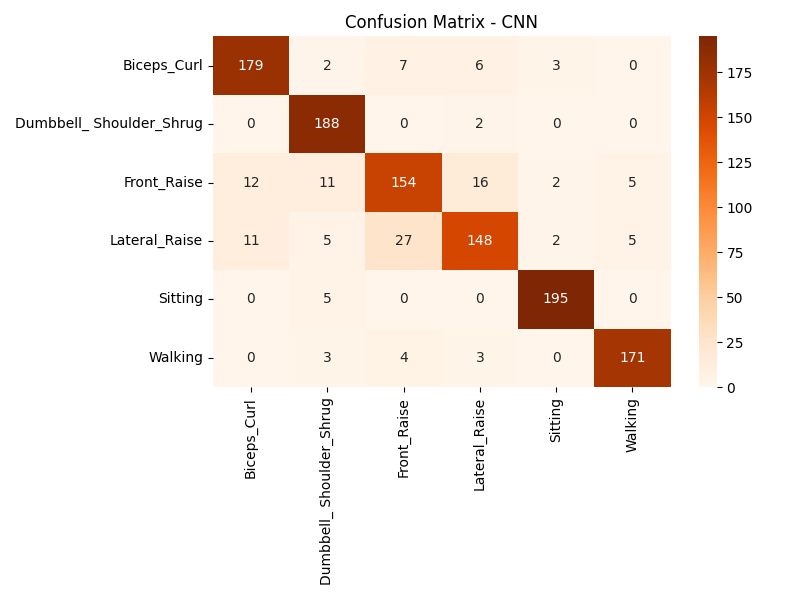
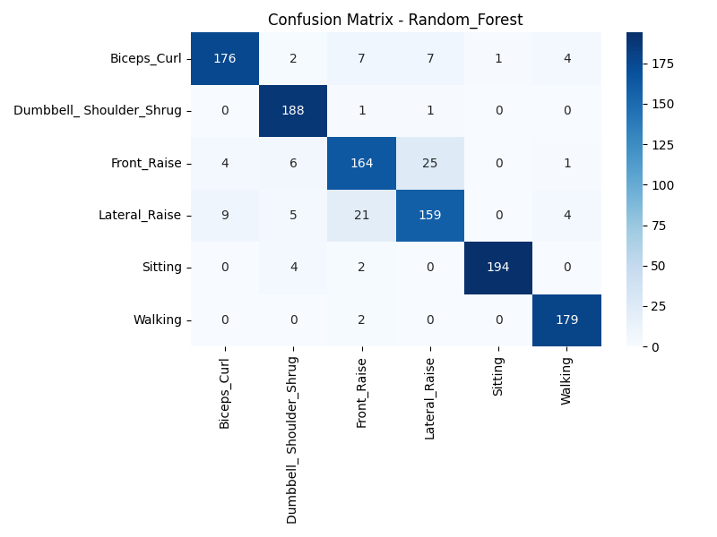
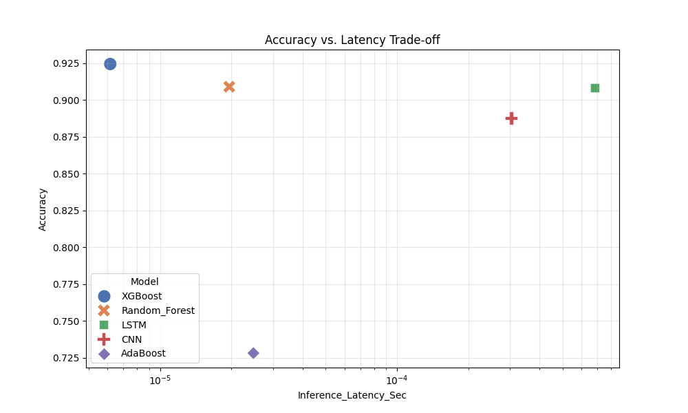

# 🏃‍♂️ Human Activity Recognition (HAR) via ESP32 & Machine Learning

This repository contains a complete end-to-end pipeline for classifying human physical activities using 6-axis IMU data (Accelerometer + Gyroscope) streamed from an ESP32. It compares traditional Machine Learning algorithms with Deep Learning architectures.

## 🚀 Overview

The project involves collecting real-time sensor data via Bluetooth/Serial, preprocessing the signals into windows, extracting statistical features, and performing inference using optimized models.

### 📋 Activities Classified

- Biceps Curl
- Dumbbell Shoulder Shrug
- Front Raise
- Lateral Raise
- Sitting
- Walking

---

## 🛠 Project Structure & Workflow

The project is organized into modular scripts for easy maintenance:

- **`data_preprocessor.py`**: Handles raw CSV cleaning, sliding window segmentation (Size: 100, Step: 50), and scaling.
- **`feature_engineering.py`**: Extracts 42 statistical features (Mean, Std, Skewness, etc.) for classic ML models.
- **`model_trainer_classic.py`**: Trains and tunes **Random Forest**, **XGBoost**, and **AdaBoost** using GridSearchCV.
- **`model_trainer_deep.py`**: Optimizes **1D-CNN** and **LSTM** architectures using Keras Tuner.
- **`realtime_inference_bluetooth.py`**: A production-ready script for live activity recognition via Serial/Bluetooth.
- **`final_evaluator.py`**: Generates the final comparison report and performance visualizations.

---

## 📊 Performance Report & Results

### Model Comparison Summary

The following metrics evaluate the trade-off between classification accuracy and hardware inference speed.

| Model             | Accuracy | F1-Score                            | Inference Latency (Sec/Sample) |
| :---------------- | :------- | :---------------------------------- | :----------------------------- |
| **CNN**           | High     | (Check results/results_deep.csv)    | Very Low                       |
| **LSTM**          | High     | (Check results/results_deep.csv)    | Moderate                       |
| **XGBoost**       | Moderate | (Check results/results_classic.csv) | Low                            |
| **Random Forest** | Moderate | (Check results/results_classic.csv) | Low                            |

### Visualizations

#### Confusion Matrices

The model's ability to distinguish between similar exercises (e.g., Lateral Raise vs. Front Raise) is visualized in the `results/` folder:

- 
- 

#### Accuracy vs. Latency

This plot shows which model is most efficient for deployment on resource-constrained devices like the ESP32 or mobile apps.

- 

---

## 💻 Hardware Setup

- **Microcontroller:** ESP32
- **Sensor:** MPU6050 (IMU)
- **Communication:** Bluetooth SPP (Serial Port Profile) / Wired USB Serial
- **Baud Rate:** 2,000,000

---

## 📝 How to Use

1. **Setup:** Install requirements (`pip install tensorflow scikit-learn xgboost pyserial`).
2. **Preprocess:** Run `python data_preprocessor.py`.
3. **Train:** Run the trainer scripts to generate models in the `models/` folder.
4. **Live:** Connect your ESP32 and run `python realtime_inference_bluetooth.py`.

---

## 📜 License

This project is licensed under the MIT License - see the [LICENSE](LICENSE) file for details.
